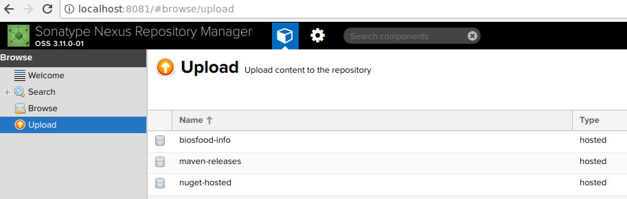

# Team's Maven repository manager
## Introduction
If your team develops few projects that use in-house developed artifacts, like utils, services or
other features then it's a good time to organize your own repository for those artifacts.
Each artifact is a dependency in your projects and the artifacts require a repository manager to be smoothly managed and used.
If you use `Maven` or `Gradle` as a dependency manager than you can install a team's repository manager.


> A repository manager is a dedicated server application designed to manage repositories of binary components. 
> The usage of a repository manager is considered an essential best practice for any significant usage of Maven.

## Available repository managers
You can discover available repository managers by a link [Available repository managers](https://maven.apache.org/repository-management.html)

## Configuring a repository manager
For my installation I chose [Sonatype Nexus Repository Manager](https://www.sonatype.com/nexus-repository-oss). Just download
the package, unpack it, and from `bin` directory launch the repository manager run following command:

```user:~$ /nexus/installation/path/bin/nexus start```


Nexus is available by url `http://localhost:8081/` and default credentials are: 
- user name is `admin`;
- password is `admin123`.

## Create a new repository
To create a new repository you need to sign in and go to `Settings -> Repository -> Repositories` and click a button
`Create repository`.


In a new view click `maven2 (hosted)` and then in a new view write a new name of the new repository `biosfood-info`.
The last view contains few more settings for the repository if it contains releases, or snapshots or both, 
if it's possible to redeploy the same version or not. The settings are quite straightforward. I left default settings:
my repository accepts only releases and layout policy is strict. Finally, click `Create repository` button and the new repository is available now.

## Create a user for deployment
To deploy an artifact in a repository we will need a user. The simplest way to go to `Settings -> Security -> User` and
create a new one here. I created a new user with a user's name `deployment` and password `deployment` and role `nx-admin`.
That user will be used to deployment.

That all modifications you need to do in Nexus to deploy any artifact in the repository. Then you need to configure 
your Maven project.

I described a very simple way adding a new user. I believe if you spend a little bit more time to discover `privileges` and
`roles` sections you will find how to grant permissions only for a newly created repository by creating new privileges,
assigning them to a role, and role to a user.

## Manual deployment

This article describes release and deploy processes of an artifact as solid and automated.
It's possible split one release step in plugin into smaller steps:
- compile and pack;
- change versions in `pom.xml`;
- push changes to VCS and create a tag;
- deploy the artifact into Maven.


You will need to discover Maven commands how to achieve each step.

But it's easier to join all those steps into one with just one plugin. If you wish only to create an artifact and deploy
the artifact to a repository you can do it manually. Generate a jar file - artifact and then go to main page of the repository manager.
You will find a button `Upload`. By clicking the button in the right side available repositories for upload will be found.
Choose a desired repository, click on it and then fill all fields.




## Automated deployment
### Project
Before you can deploy anything into a repository manager you need to create a project that will be released.
I prepared quite simple structure for demonstration purposes. The project contains `UrlService`, implementation and
a factory that creates an instance of a `UrlService` based on some conditions.


### Configuring Maven settings

To be able to deploy anything in your repository you need to apply global settings for your Maven. Go to Maven folder (default one is `.m2`)
and create a file `settings.xml`.  If you can't find Maven folder then try to call command <br />`mvn help:evaluate -Dexpression=settings.localRepository`
in terminal, it will print a path to a repository.

We need to create a section `servers` and add a new server. The server will contain only `id` and a user name and a password. 
Use credentials of a user that you created in Nexus - `deployment`. All properties of a server entry are important.

```xml
<settings xmlns="http://maven.apache.org/SETTINGS/1.0.0"
      xmlns:xsi="http://www.w3.org/2001/XMLSchema-instance"
      xsi:schemaLocation="http://maven.apache.org/SETTINGS/1.0.0
                          https://maven.apache.org/xsd/settings-1.0.0.xsd">
	<servers>
	   <server>
		  <id>biosfood-releases</id>
		  <username>deployment</username>
		  <password>deployment</password>
	   </server>
	</servers> 
</settings>
```

### Change your pom.xml
#### Plugin
To release and deploy in Nexus simultaneously and in automatic way during a build it's better to use a plugin that actually do all job.
All you need to configure here is a template for a tag's name. If you need that, you can setup automatic version update for sub-modules.


```xml
<plugin>
    <groupId>org.apache.maven.plugins</groupId>
    <artifactId>maven-release-plugin</artifactId>
    <version>2.5.3</version>
    <configuration>
        <tagNameFormat>v-@{project.version}</tagNameFormat>
        <autoVersionSubmodules>true</autoVersionSubmodules>
    </configuration>
</plugin>
```

### Scm block

For committing data in your VCS you need to setup `scm` block. I use Git and I provide here setup for for that system only.
I put in properties my repository URL, because it's repeated few times and it's easier to change it in one place.

```xml
<properties>
    <git.url>https://USER_NAME@HOST/PATH/TO/YOUR/REPOSITORY.git</git.url>
</properties>
```


Configuration for Git looks very simple.
```xml
<scm>
    <connection>scm:git:${git.url}</connection>
    <url>${git.url}</url>
    <developerConnection>scm:git:${git.url}</developerConnection>
    <tag>HEAD</tag>
</scm>
```

### Distribution block
Third important block is `distributionManagement`. Remember, we created Maven configuration file `settings.xml`?
We need a server id from that file to use in `repository` block in the `id` tag. Then you need to configure URL
for your repository. The URL could be taken from repository settings page. The page contains a field URL.  

```xml
<distributionManagement>
    <repository>
        <id>biosfood-releases</id>
        <url>http://localhost:8081/repository/biosfood-info/releases</url>
    </repository>
</distributionManagement>
```

That all settings you need to apply in `pom.xml`. Then you need to run release command.

### Versioning in pom.xml
There is one rule we need to follow to create a release. Current development version has to contains suffix `-SNAPSHOT`
in `pom.xml` file in a version tag. For example, `<version>1.2.3-SNAPSHOT</version>`.
You can't have a release if your `pom.xml` version doesn't contains that suffix.

### Release and deploy to Nexus

To release and deploy an artifact you need to run `mvn release:clean release:prepare release:perform -Dmaven.test.skip=true`. 
During invocation the command you will be asked about new release version's value, tag name in VCS, and new snapshot version's value. 
It's possible that you will be asked few times for VCS password when the system commits data and creates tags. If VCS continues to ask 
your credentials and it bothers you that you can switch to certificate authentication for VCS.

In the end of invoking the command will have:
- new snapshot version in your `pom.xml` and in git;
- new tag in VCS;
- deployed new version artifact in your repository.


## Usage in another project
To setup the dependency in another project all you need to take three steps.

### Step 1. Setup repository
In project's `pom.xml` create a section `repositories` and add our repository `biosfood-info/releases`.

```xml
<repositories>
    <repository>
        <id>nexus-releases</id>
        <url>http://localhost:8081/repository/biosfood-info/releases</url>
    </repository>
</repositories>
```

### Step 2. Add a new dependency

In `pom.xml` in `dependencies` section add a new dependency `maven.nexus.sample.artifact`. Maven should update indexes
and after that dependency's classes are available for usage in your source code. 

```xml
<dependencies>
    <dependency>
        <groupId>info.biosfood</groupId>
        <artifactId>maven.nexus.sample.artifact</artifactId>
        <version>1.0</version>
    </dependency>
</dependencies>
```

### Step 3. Use it
Create your Java classes and use classes from the new dependency like `UrlService` and `UrlServiceFactory`.

```java
package info.biosfood.maven.nexus.sample.usage;

import info.biosfood.maven.nexus.sample.artifact.UrlServiceFactory;
import info.biosfood.maven.nexus.sample.artifact.UrlService;

public class BankService {

    UrlService urlService;

    public BankService() {
        urlService = UrlServiceFactory.create();
    }

}
```

## Conclusion
That is it. I believe to setup your own repository manager is quite simple task, but it required multiple steps. 
I would like to highlight that described process is just one way how to organize deployment. Also you can skip plugin 
usage and use direct deployment commands from Maven. You can find a guide below. 


## Useful links
[Available repository managers](https://maven.apache.org/repository-management.html)
[Maven release plugin](http://maven.apache.org/maven-release/maven-release-plugin/)
[Guide to deploying 3rd party JARs to remote repository](https://maven.apache.org/guides/mini/guide-3rd-party-jars-remote.html)

